 

This is the entry point to **5G-MAG's Technical Resources**. It includes resources related to specification analysis and implementation, explainers and reports, videos,...

[Overview about 5G-MAG](#overview-about-5g-mag){: .btn .btn-blue }

---

<table>
  <tr>
    <td markdown="span" align="center"><a href="./pages/5g-media-streaming.html">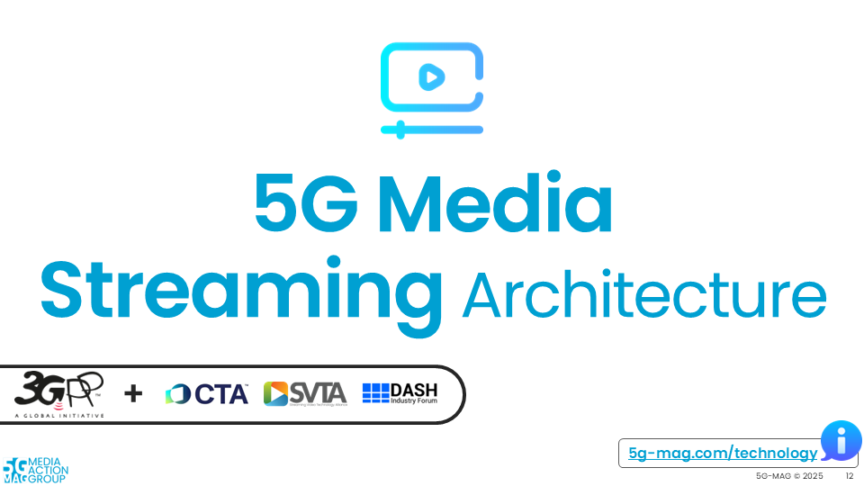<a/></td>
    <td markdown="span" align="center"><a href="./pages/data-collection-event-exposure.html"><a/></td>
  </tr>
  <tr>
    <td markdown="span" align="center">[Technical Resources](./pages/5g-media-streaming.html){: .btn .btn-blue } [Execution Plan](https://github.com/orgs/5G-MAG/projects/44/views/9){: .btn .btn-blue } </td>
    <td markdown="span" align="center">[Technical Resources](./pages/data-collection-event-exposure.html){: .btn .btn-blue } [Execution Plan](https://github.com/orgs/5G-MAG/projects/44/views/21){: .btn .btn-blue } </td>
  </tr>
    <td> </td>
  <tr>
    <td markdown="span" align="center"><a href="./pages/lte-based-5g-broadcast/">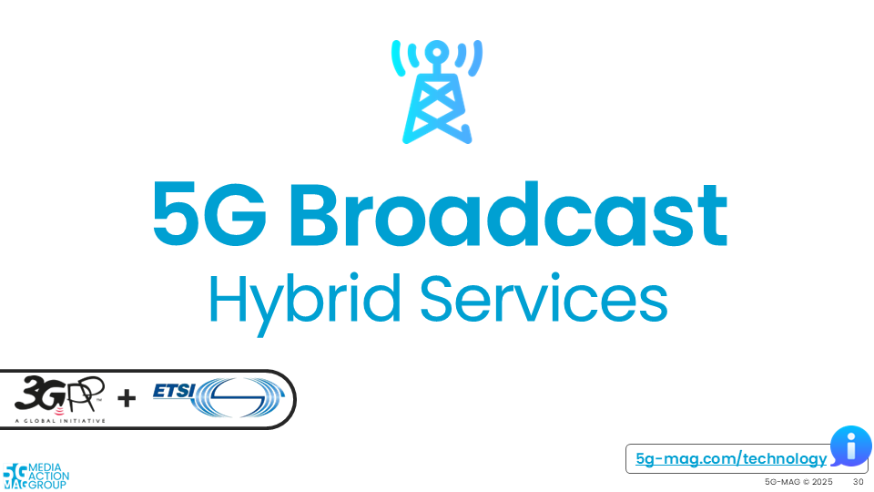<a/></td>
    <td markdown="span" align="center"><a href="./pages/5g-multicast-broadcast-services/">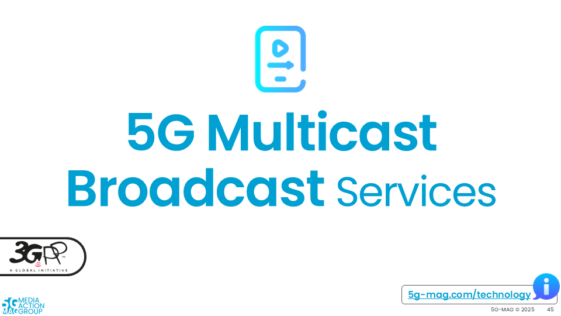<a/></td>
  </tr>
  <tr>
    <td markdown="span" align="center">[Technical Resources](./pages/lte-based-5g-broadcast.html){: .btn .btn-blue } [Execution Plan](https://github.com/orgs/5G-MAG/projects/44/views/10){: .btn .btn-blue } </td>
    <td markdown="span" align="center">[Technical Resources](./pages/5g-multicast-broadcast-services.html){: .btn .btn-blue } [Execution Plan](https://github.com/orgs/5G-MAG/projects/44/views/7){: .btn .btn-blue } </td>
  </tr>
    <td> </td>
  <tr>
    <td markdown="span" align="center"><a href="./pages/rtc.html">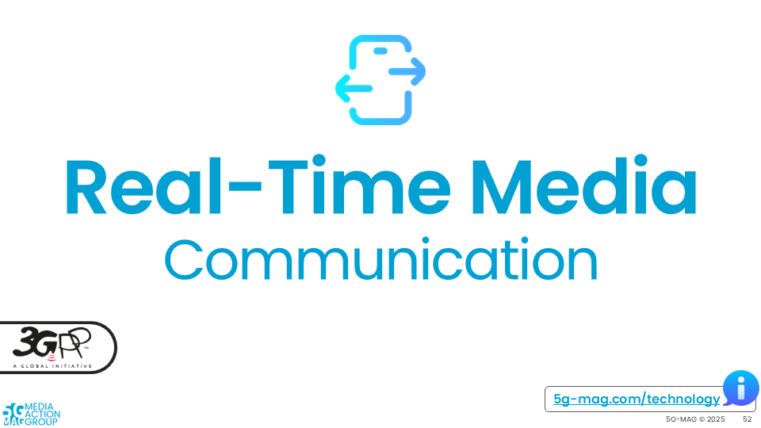<a/></td>
    <td markdown="span" align="center"><a href="./pages/network_apis.html">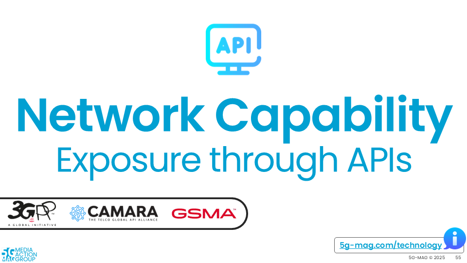<a/></td>
  </tr>
  <tr>
    <td markdown="span" align="center">[Technical Resources](./pages/rtc.html){: .btn .btn-blue } [Execution Plan](https://github.com/orgs/5G-MAG/projects/44/views/19){: .btn .btn-blue } </td>
    <td markdown="span" align="center">[Technical Resources](./pages/network_apis.html){: .btn .btn-blue } [Execution Plan](https://github.com/orgs/5G-MAG/projects/44/views/8){: .btn .btn-blue } </td>
  </tr>
    <td> </td>
  <tr>
    <td markdown="span" align="center"><a href="./pages/ntn.html">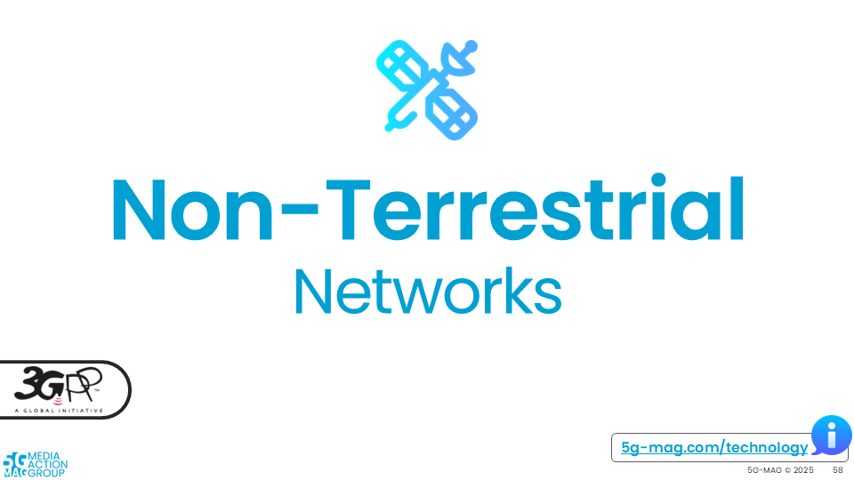<a/></td>
    <td markdown="span" align="center"><a href="./pages/npn.html">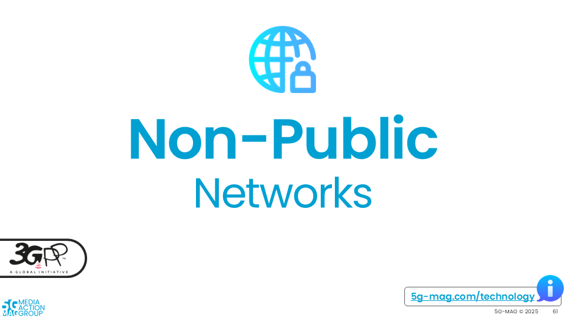<a/></td>
  </tr>
  <tr>
    <td markdown="span" align="center">[Technical Resources](./pages/ntn.html){: .btn .btn-blue } [Execution Plan](https://github.com/orgs/5G-MAG/projects/44/views/6){: .btn .btn-blue } </td>
    <td markdown="span" align="center">[Technical Resources](./pages/npn.html){: .btn .btn-blue } [Execution Plan](https://github.com/orgs/5G-MAG/projects/44/views/11){: .btn .btn-blue } </td>
  </tr>
    <td> </td>
  <tr>
    <td markdown="span" align="center"><a href="./pages/tsc.html">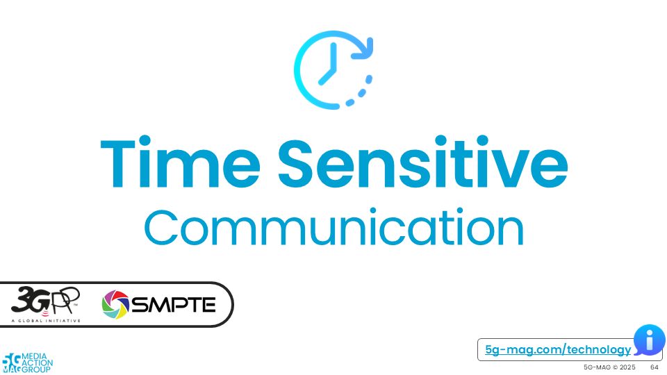<a/></td>
    <td markdown="span" align="center"><a href="./pages/xr.html">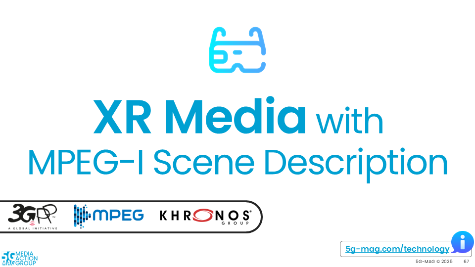<a/></td>
  </tr>
  <tr>
    <td markdown="span" align="center">[Technical Resources](./pages/tsc.html){: .btn .btn-blue } [Execution Plan](https://github.com/orgs/5G-MAG/projects/44/views/12){: .btn .btn-blue } </td>
    <td markdown="span" align="center">[Technical Resources](./pages/xr.html){: .btn .btn-blue } [Execution Plan](https://github.com/orgs/5G-MAG/projects/44/views/13){: .btn .btn-blue } </td>
  </tr>
    <td> </td>
  <tr>
    <td markdown="span" align="center"><a href="./pages/volumetric-video.html">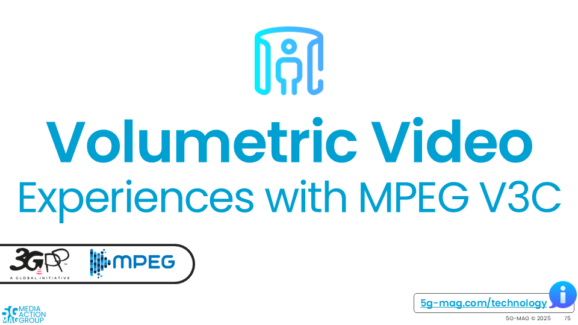<a/></td>
    <td markdown="span" align="center"><a href="./pages/beyond2d.html">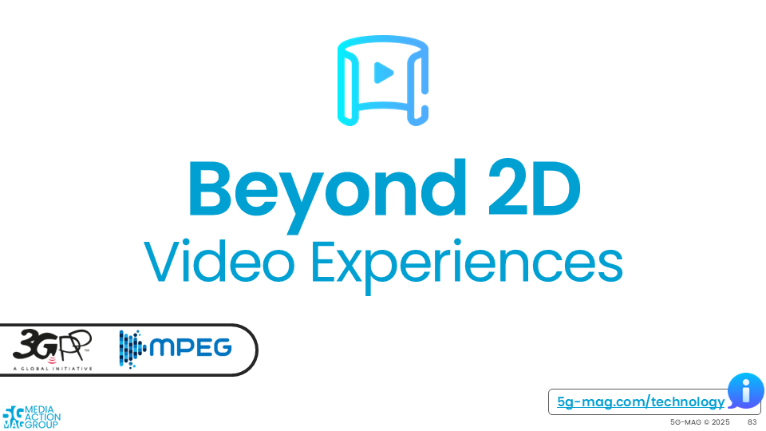<a/></td>
  </tr>
  <tr>
    <td markdown="span" align="center">[Technical Resources](./pages/volumetric-video.html){: .btn .btn-blue } [Execution Plan](https://github.com/orgs/5G-MAG/projects/44/views/18){: .btn .btn-blue } </td>
    <td markdown="span" align="center">[Technical Resources](./pages/beyond2d.html){: .btn .btn-blue } [Execution Plan](https://github.com/orgs/5G-MAG/projects/44/views/15){: .btn .btn-blue } </td>
  </tr>
    <td> </td>
  <tr>
    <td markdown="span" align="center"><a href="./pages/ai-ml-evaluation-framework/">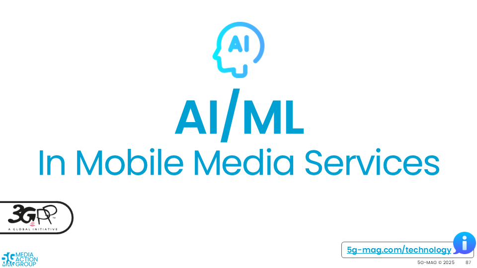<a/></td>
    <td markdown="span" align="center"><a href="./pages/multimedia-content-delivery/">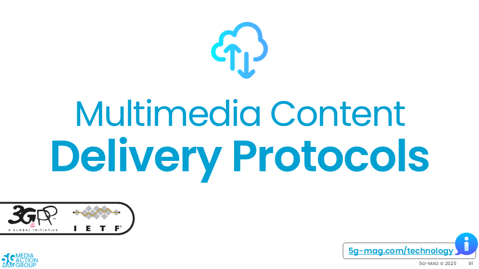<a/></td>
  </tr>
  <tr>
    <td markdown="span" align="center">[Project Documentation](./pages/ai-ml-evaluation-framework/){: .btn .btn-blue } [Project Roadmap](https://github.com/orgs/5G-MAG/projects/44/views/16){: .btn .btn-blue } </td>
    <td markdown="span" align="center">[Project Documentation](./pages/multimedia-content-delivery/){: .btn .btn-blue } [Project Roadmap](https://github.com/orgs/5G-MAG/projects/44/views/22){: .btn .btn-blue } </td>
  </tr>
    <td> </td>
  <tr>
    <td markdown="span" align="center"><a href="./pages/dvb-i-5g.html">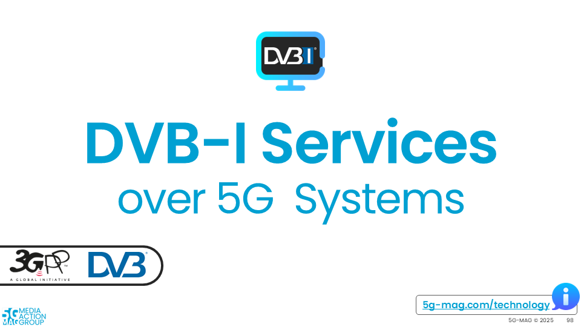<a/></td>
    <td markdown="span" align="center"><a href="./pages/6g.html">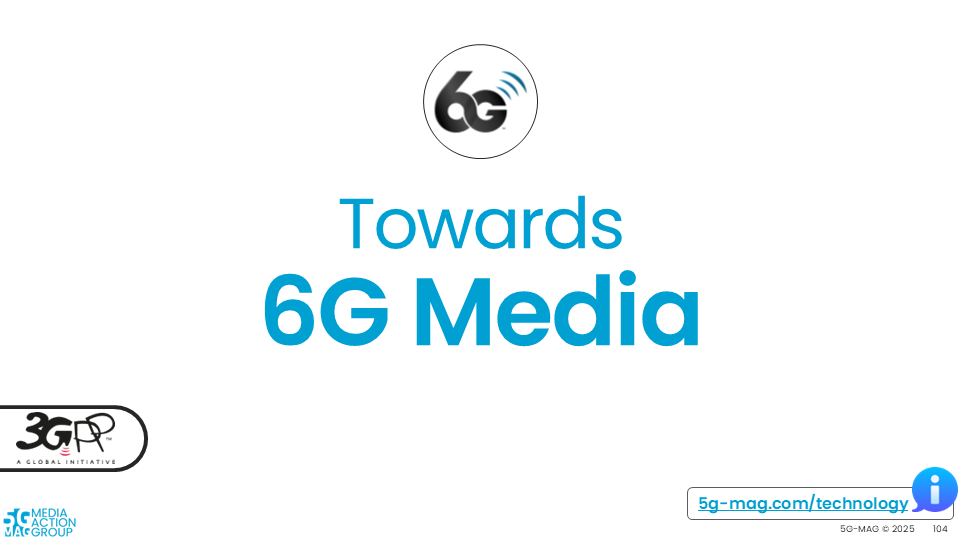<a/></td>
  </tr>
  <tr>
    <td markdown="span" align="center">[Project Documentation](./pages/dvb-i-5g.html){: .btn .btn-blue } [Project Roadmap](https://github.com/orgs/5G-MAG/projects/44/views/17){: .btn .btn-blue } </td>
    <td markdown="span" align="center">[Project Documentation](./pages/6g.html){: .btn .btn-blue } [Project Roadmap](https://github.com/orgs/5G-MAG/projects/44/views/20){: .btn .btn-blue } </td>
  </tr>
</table>

# Overview about 5G-MAG

<iframe width="60%" height="520" src="./docs/5G_MAG_Overview.pdf"></iframe>

[Download the slidedeck for an Overview about 5G-MAG](./docs/5G_MAG_Overview.pdf){: .btn .btn-blue }

{: .note }
Copyright: 5G Media Action Group (5G-MAG). Please refer to the [Getting-Started](https://github.com/5G-MAG/Getting-Started/tree/main/pages) repository to provide updates to this documentation.
