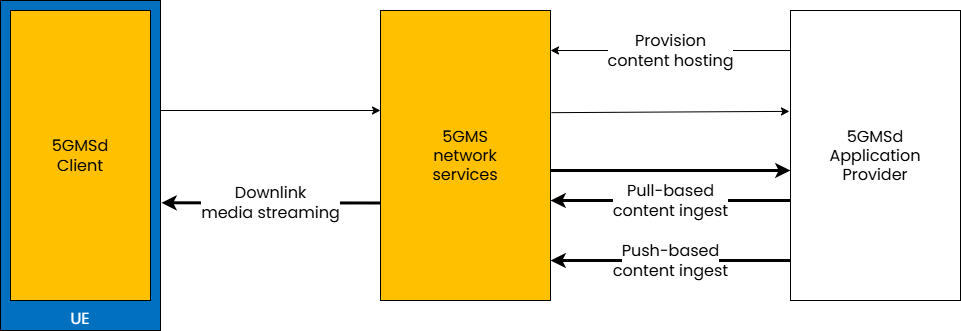
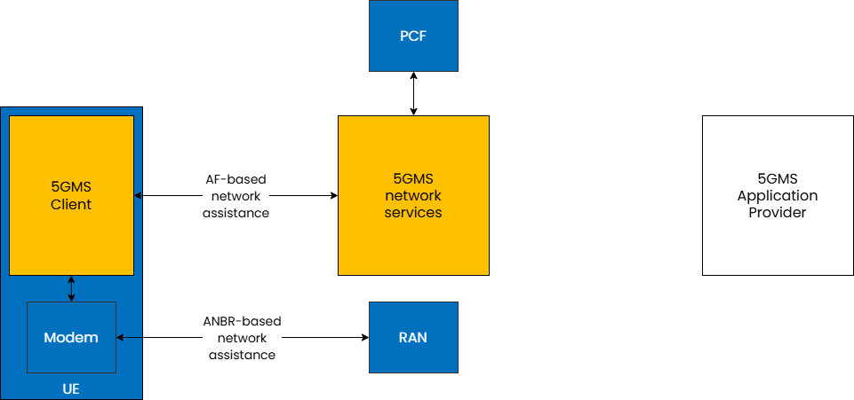
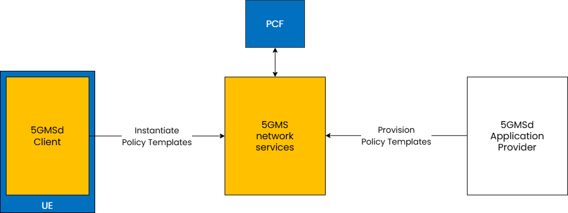
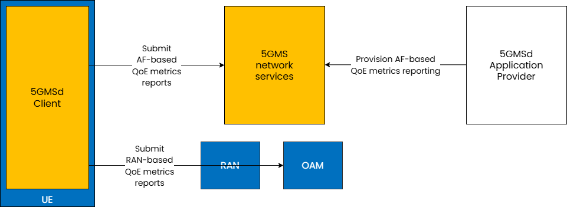

 

{: .warning }
This documentation is currently **under development and subject to change**. It reflects outcomes elaborated by 5G-MAG members. If you are interested in becoming a member of the 5G-MAG and actively participating in shaping this work, please contact the [Project Office](https://www.5g-mag.com/contact)

## Key Features for 5GMSd

The following features are defined for Downlink Media Streaming.

Feature | Description | Procedure | APIs 
--- | --- | --- | ---
Content hosting | 3GPP TS 26.501 4.0.2 | 3GPP TS 26.501 5.4 | 3GPP TS 26.510 + 26.512
Network assistance | 3GPP TS 26.501 4.0.5 | 3GPP TS 26.501 5.9 | 3GPP TS 26.510 + 26.512
Dynamic policies | 3GPP TS 26.501 4.0.6 | 3GPP TS 26.501 5.8 | 3GPP TS 26.510 + 26.512
Consumption reporting | 3GPP TS 26.501 4.0.8 | 3GPP TS 26.501 5.6 | 3GPP TS 26.510 + 26.512
QoE metrics reporting | 3GPP TS 26.501 4.0.9 | 3GPP TS 26.501 5.5 | 3GPP TS 26.510 + 26.512
Edge processing | 3GPP TS 26.501 4.0.10 | 3GPP TS 26.501 8 | 3GPP TS 26.510 + 26.512
eMBMS delivery | 3GPP TS 26.501 4.0.11 | 3GPP TS 26.501 5.10 | 3GPP TS 26.510 + 26.512
Data collection, reporting and exposure | 3GPP TS 26.501 5.11 | 3GPP TS 26.510 + 26.512

## Feature: Content Hosting

{: .referencetools }
Go to the [5G Media Streaming Project](https://hub.5g-mag.com/Getting-Started/pages/5g-media-streaming/)

### Description
The content hosting feature provides a service equivalent to a Content Delivery Network (CDN) deployed inside or outside the Trusted DN.

### Reference points and interactions (according to 3GPP TS 26.510)

Reference Point | Interactions | API Name | Description
--- | --- | --- | ---
M1 | 5.2.2 | [Provisioning Sessions API](https://jdegre.github.io/loader.html?yaml=TS26512_M1_ProvisioningSessions.yaml) | 8.2
M1 | 5.2.3 | [Content protocols discovery API](https://jdegre.github.io/loader.html?yaml=TS26512_M1_ContentProtocolsDiscovery.yaml) | 8.3
M1 | 5.2.4 | [Server Certificates provisioning API](https://jdegre.github.io/loader.html?yaml=TS26512_M1_ServerCertificatesProvisioning.yaml) | 8.4
M1 | 5.2.5 | [Content Preparation Templates provisioning API](https://jdegre.github.io/loader.html?yaml=TS26512_M1_ContentPreparationTemplatesProvisioning.yaml) | 8.5
M1 | 5.2.6 | [Edge Resources provisioning API](https://jdegre.github.io/loader.html?yaml=TS26512_M1_EdgeResourcesProvisioning.yaml) | 8.6
M1 | 5.2.7 | [Policy Templates provisioning API](https://jdegre.github.io/loader.html?yaml=TS26512_M1_PolicyTemplatesProvisioning.yaml) | 8.7
M1 | 5.2.8 | [Content Hosting provisioning API](https://jdegre.github.io/loader.html?yaml=TS26512_M1_ContentHostingProvisioning.yaml) | 8.8
M5 | 5.3.2 | [Service Access Information API](https://jdegre.github.io/loader.html?yaml=TS26512_M5_ServiceAccessInformation.yaml) | 9.2

## Feature: Network Assistance

### Description
The network assistance feature enables the 5GMS Client in the UE to interrogate or manipulate the network Quality of Service for an ongoing media streaming session. It defines two mechanisms for obtaining network assistance via interactions with the PCF (AF-based network assistance) or via ANBR signalling interactions between the UE modem and the RAN (ANBR-based network assistance). 

Both mechanisms allow to obtain:

* Bit Rate Recommendation (Throughput Estimation), which allows the 5GMS Client to stay synchronized with the network's current capabilities.
  * The Process: The client asks the 5GMS System for a bit rate estimate. The system then queries the Policy Control Function (PCF) to determine the available throughput for that specific session.
  * The Action: The client uses this data to proactively adjust its streaming speed—either by switching media quality levels (downlink).
  * The Benefit: It prevents stuttering and lag, ensuring a stable and consistent Quality of Experience (QoE) by staying within the network's "QoS envelope."

* Delivery Boost, which is a reactive feature used to request extra network performance when needed.
  * The Process: The client requests a temporary increase in bit rate. The 5GMS System asks the PCF to modify the session parameters to grant this extra capacity.
  * The Action: If the network has spare capacity, the boost is granted. The client uses this "boost" of speed to quickly refill a depleted buffer or finish a large file transfer faster.
  * The Benefit: It helps the user recover from potential playback interruptions or speeds up time-sensitive data tasks.

### Reference points and interactions (according to 3GPP TS 26.510)

Reference Point | Interactions | API Name | Description
--- | --- | --- | ---
M5 | 5.3.2 | [Service Access Information API](https://jdegre.github.io/loader.html?yaml=TS26512_M5_ServiceAccessInformation.yaml) | 9.2
M5 | 5.3.4 | [Network Assistance API](https://jdegre.github.io/loader.html?yaml=TS26512_M5_NetworkAssistance.yaml) | 9.4

## Feature: Dynamic Policies

### Description
The dynamic policies feature enables the 5GMS Client in the UE to manipulate the network traffic handling policies for an ongoing media streaming session.

### Reference points and interactions (according to 3GPP TS 26.510)

Reference Point | Interactions | API Name | Description
--- | --- | --- | ---
M1 | 5.2.2 | [Provisioning Sessions API](https://jdegre.github.io/loader.html?yaml=TS26512_M1_ProvisioningSessions.yaml) | 8.3
M1 | 5.2.7 | [Policy Templates provisioning API](https://jdegre.github.io/loader.html?yaml=TS26512_M1_PolicyTemplatesProvisioning.yaml) | 8.7
M5 | 5.3.2 | [Service Access Information API](https://jdegre.github.io/loader.html?yaml=TS26512_M5_ServiceAccessInformation.yaml) | 9.2
M5 | 5.3.3 | [Dynamic Policies API](https://jdegre.github.io/loader.html?yaml=TS26512_M5_DynamicPolicies.yaml) | 9.3

## Feature: Consumption Reporting

{: .referencetools }
Go to the [5G Media Streaming Project](https://hub.5g-mag.com/Getting-Started/pages/5g-media-streaming/)

### Description
The consumption reporting feature allows consumption of downlink media streaming to be logged by the 5GMS System and exposed for analysis.

### Reference points and interactions (according to 3GPP TS 26.510)

Reference Point | Interactions | API Name | API
--- | --- | --- | ---
M1 | 5.2.2 | [Provisioning Sessions API](https://jdegre.github.io/loader.html?yaml=TS26512_M1_ProvisioningSessions.yaml) | 8.3
M1 | 5.2.12 | [Consumption Reporting provisioning API](https://jdegre.github.io/loader.html?yaml=TS26512_M1_ConsumptionReportingProvisioning.yaml) | 8.12
M5 | 5.3.2 | [Service Access Information API](https://jdegre.github.io/loader.html?yaml=TS26512_M5_ServiceAccessInformation.yaml) | 9.2
M5 | 5.3.6| [Consumption Reporting API](https://jdegre.github.io/loader.html?yaml=TS26512_M5_ConsumptionReporting.yaml) | 9.6

## Feature: QoE Metrics Reporting

{: .referencetools }
Go to the [5G Media Streaming Project](https://hub.5g-mag.com/Getting-Started/pages/5g-media-streaming/)

### Description

The QoE metrics reporting feature enables the 5GMS System to log and expose streaming performance data for further analysis.

The framework defines two distinct reporting paths:

* RAN-based Reporting: Metrics are sent to the Operations, Administration, and Maintenance (OAM) system via the Radio Access Network.

* AF-based Reporting: Metrics are sent directly to the network-side components (AF) of the 5GMS System.

### Reference points and interactions (according to 3GPP TS 26.510)

Reference Point | Interactions | API Name | API
--- | --- | --- | ---
M1 | 5.2.2 | [Provisioning Sessions API](https://jdegre.github.io/loader.html?yaml=TS26512_M1_ProvisioningSessions.yaml) | 8.3
M1 | 5.2.11 | [Metrics Reporting provisioning API](https://jdegre.github.io/loader.html?yaml=TS26512_M1_MetricsReportingProvisioning.yaml) | 8.10
M5 | 5.3.2 | [Service Access Information API](https://jdegre.github.io/loader.html?yaml=TS26512_M5_ServiceAccessInformation.yaml) | 9.2
M5 | 5.3.5 | [Metrics Reporting API](https://jdegre.github.io/loader.html?yaml=TS26512_M5_MetricsReporting.yaml) | 9.5

## Feature: Data collection, reporting and exposure (TS 26.510)

{: .referencetools }
Go to the [5G Media Streaming Project](https://hub.5g-mag.com/Getting-Started/pages/5g-media-streaming/) and the [UE Data Collection, Reporting and Event Exposure Project](https://hub.5g-mag.com/Getting-Started/pages/ue-data-collection-reporting-exposure/)

### Description

The data collection, reporting and exposure feature enables the 5GMS System to log data relating to media streaming sessions and to expose this to 
subscribers in the form of Events.

### Reference points and interactions (according to 3GPP TS 26.510)

Reference Point | Interactions | API Name | API
--- | --- | --- | ---
M1 | 5.2.13 | [Event Data Processing provisioning API](https://jdegre.github.io/loader.html?yaml=TS26512_M1_EventDataProcessingProvisioning.yaml) | 8.13
M5 | 5.3.5 | [Metrics Reporting API](https://jdegre.github.io/loader.html?yaml=TS26512_M5_MetricsReporting.yaml) | 9.5
M5 | 5.3.6 | [Consumption Reporting API](https://jdegre.github.io/loader.html?yaml=TS26512_M5_ConsumptionReporting.yaml) | 9.6
