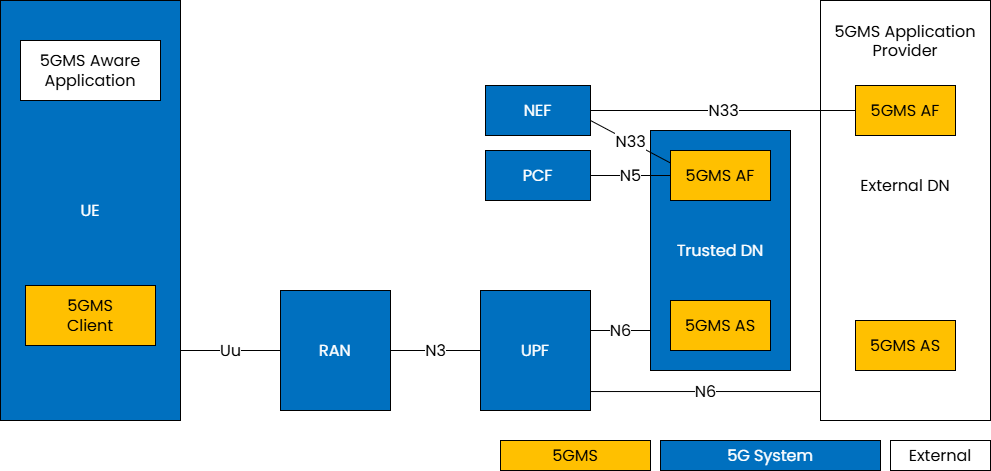
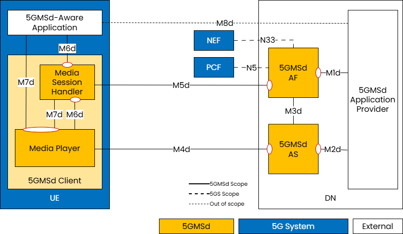
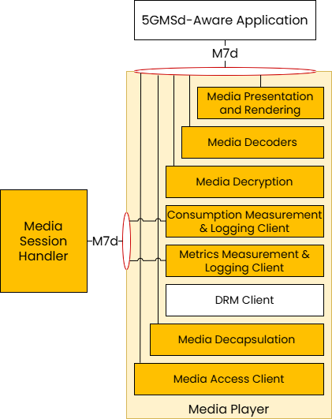
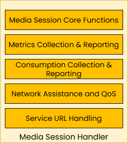

 

{: .warning }
This documentation is currently **under development and subject to change**. It reflects outcomes elaborated by 5G-MAG members. If you are interested in becoming a member of the 5G-MAG and actively participating in shaping this work, please contact the [Project Office](https://www.5g-mag.com/contact)

# 5G Media Streaming - An overview

In the context of 3GPP standards, 5G Media Streaming (5GMS) is defined as a framework designed to enable high-quality, efficient delivery of media. The architecture supports services from mobile network operators and third parties including both Downlink (5GMSd) and Uplink (5GMSu) Media Streaming. The 5GMS architecture is functionally divided into independent components enabling deployments with various degrees of integration between 5G MNOs and Content Providers.

5GMS is not a separate network but a functional extension of the standard 5G System Architecture (TS 23.501). It is the bridge that allows 5G networks to move away from being a "data pipe" and instead become an active, optimized platform for professional and user-generated media content.

The main functional entities are:

* **5GMS Application Provider**: The entity that uses the 5G network to deliver content. It provides a 5GMS Aware-Application on the UE to make use of 5GMS Client and network functions via 5GMS interfaces and APIs.

* **5GMS Application Function (5GMS AF)**: A specialized application function dedicated to the management and optimization of media streaming sessions.

* **5GMS Application Server (5GMS AS)**:  A specialized application server which primary job is to store, cache, and deliver media content to the User Equipment (UE) or to receive and ingest media from the UE

* **5GMS Client**: The functional part of the user's device (UE) that handles the media session and the player/streamer logic.

# 5G Unicast Downlink Media Streaming (5GMSd)

{: .referencetools }
Go to the [5G Media Streaming Project](https://hub.5g-mag.com/Getting-Started/pages/5g-media-streaming/)

To deliver downlink streaming services, the network is the origin of the media and the UE acts as the consumption device.
 

The main functional entities are:

* **5GMSd Application Provider**: The external entity responsible for the "source" side of the media—creating, encoding, and formatting the content. It utilizes 5GMSd interfaces to deliver this media to the user's application.

* **5GMSd AS**: The hosting environment for media content. It can be a single server or a distributed network, such as a Content Delivery Network (CDN), to optimize delivery.

* **5GMSd AF**: The control-plane entity providing management functions to the device’s Media Session Handler and the Application Provider. It also acts as the bridge to the 5G Core, interacting with the PCF or NEF.

* **5GMSd Client**: The primary receiver on the device for downlink streaming services. It can be implemented with exposing APIs (M6d/M7d) for external use or as a self-contained entity where those interfaces are internal. It consists of two sub-components:

  * **Media Session Handler**: The "control brain" on the device. It coordinates with the 5GMSd AF to set up and manage sessions while gathering data like Quality of Experience (QoE) and consumption metrics.

  * **Media Player**: The "data engine" on the device. It communicates with the 5GMSd AS to fetch and play the actual media stream. It provides playback controls to the app and session status to the Session Handler.

* **5GMSd-Aware Application**: An external app (e.g., a streaming service) that holds the provider's specific logic. Uses standardized APIs to initiate and manage media sessions.

The 5GMSd Client may include several subfunctions which are depicted below:

<table>
  <tr>
    <td markdown="span" align="center"><a/></td>
    <td markdown="span" align="center"><a/></td>
  </tr>
  <tr>
    <td markdown="span" align="center">Subfunctions of the Media Player</td>
    <td markdown="span" align="center">Subfunctions of the Media Session Handler</td>
  </tr>
</table>

The interfaces are:

| Interface | Name | Description |
| :--- | :--- | :--- |
| **M1d** | **5GMSd Provisioning API** | External API exposed by the **5GMSd AF**; allows the Application Provider to configure the system for downlink streaming and receive feedback. |
| **M2d** | **5GMSd Ingest API** | Optional external API exposed by the **5GMSd AS**; used for uploading content when the AS is hosted within a trusted Data Network. |
| **M3d** | Internal Interface | An **unspecified internal API** used for information exchange between the 5GMSd AF and AS regarding content hosting. |
| **M4d** | **Media Streaming APIs** | The primary data-plane APIs exposed by the **5GMSd AS** to the **Media Player** for streaming media content. |
| **M5d** | **Media Session Handling API** | Control-plane APIs between the **5GMSd AF** and **Media Session Handler** for session control, QoE reporting, and security (auth/auth). |
| **M6d** | **UE Media Session Handling APIs** | Internal UE APIs that allow the **5GMSd-Aware App** and the **Media Player** to access 5GMS session functions. |
| **M7d** | **UE Media Player APIs** | Internal UE APIs used by the **5GMSd-Aware App** and **Session Handler** to control playback and media engine functions. |
| **M8d** | **Application API** | An external interface for "service-level" exchange (like metadata or login) between the **App** and the **Provider**. This is **not specified** by 3GPP. |
