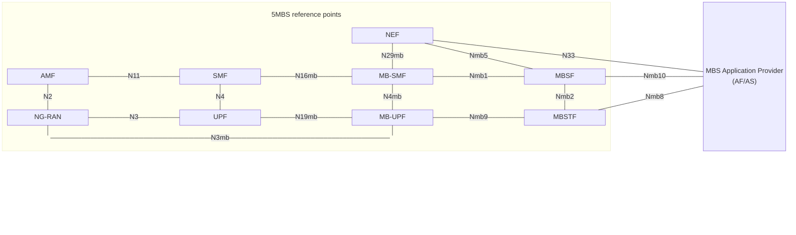

{: .warning }
This documentation is currently **under development and subject to change**. If you are interested in becoming a member of the 5G-MAG and actively participating in shaping this work, please contact the [Project Office](https://www.5g-mag.com/contact)

# MBS Service Layer Aspects

## Media Streaming sessions over MBS User Services (TS 26.501)
Void

## MBS User Services (TS 26.502)
The primary goal of the MBS User Services architecture specified in TS 26.502 is to provide a higher-level abstraction on top of MBS Services that is more useful to a Content Service Provider, referred to in TS 26.502 as an **MBS Application Provider**. This entity plays the role of the AF/AS in the lower-level MBS Services architecture defined in TS 23.247 and described in section 4 below.

The MBS User Services abstraction comprises three principal data entities:
* The **MBS User Service** includes basic top-level metadata about itself, such as a type (broadcast or multicast) name, description and main service language.
*	Each MBS User Service defines a set of **MBS User Data Ingest Sessions**. These optionally define a time schedule for activation (if they are not intended to run 24/7) as well as a set of MBS Distribution Sessions, one for each service component or regional variant of the parent MBS User Service.
*	Each **MBS Distribution Session** corresponds to one MBS Session in the MB-SMF. In the case of regional variations, the MBS Distribution Session is provisioned with a target region and, as a result, each one maps to a location-specific MBS Service.
The overall system architecture for MBS User Services (green) and MBS Services (purple) is depicted in figure 3.2-1. The (green) MBS User Services functions are optional in an MBS System: it is valid to omit them entirely, in which case the AF/AS must provision low-level MBS Services directly with the (purple) MB-SMF at reference point Nmb13 (or N33+N29mb, if outside the trusted network), and then injects MBS data directly into the (purple) MB-UPF at reference point N6mb. See section 4 below for details.

<figure>
    
    <figcaption><em>System architecture for MBS Services (purple) and MBS User Services (green) in reference point notation, based on TS 23.247</em></figcaption>
</figure>

{: .note }
The above figure is subject to change following ongoing discussion about security architecture. In particular, there is a proposal for the MBSF to be directly attached to the user plane in order to support the user plane client authentication procedure defined in TS 33.501 annex W.4.

As with existing Network Functions in the 5G Core, the additional control plane entities (top half of the figure) communicate using service-based interfaces based on HTTP/2-based RESTful interactions defined using OpenAPI schemas. In the data plane (bottom half of the figure), individual protocols are defined at each reference point.

Two MBS User Services functions are defined by SA2 in TS 23.247, but their detailed design was delegated to SA4:

* The **Multicast–Broadcast Service Function (MBSF)** is the control plane entity responsible for maintaining the provisioning state for MBS User Services and for controlling their life-cycle. The AF/AS provisions each MBS User Service at reference point Nmb10 by invoking the Nmbsf service. (If the AF/AS resides outside the trusted domain, the Nmbsf service is instead invoked via the NEF at reference point N33+Nmb5.) A set of MBS User Data Ingest Sessions is provisioned underneath the umbrella of the MBS User Service, each one comprising one or more MBS Distribution Sessions. Based on the set of MBS Distribution Sessions provisioned, the MBSF invokes the Nmbsmf service on the MB-SMF at reference point Nmb1 to provision corresponding low-level MBS Services, and also configures a corresponding set of MBS Distribution Sessions in the MBSTF by invoking the Nmbstf service at reference point Nmb2.

  *	Reference point Nmb13 (or N33+N29mb via the NEF if the AF/AS resides outside the trusted domain) may still be used in parallel with Nmb10 when MBS User Services are in play. The AF/AS may pre-allocate TMGIs for MBS Distribution Sessions by invoking the Nmbsmf_TMGI_Allocate service operation directly, and then cite the allocated TMGI in a subsequent provisioning request to the MBSF. However, the MBSF is also able to allocate TMGIs as a side-effect of MBS User Service provisioning, and this simpler procedure is preferable in the common case where the AF/AS does not need pre-allocation of a TMGI.

* The **Multicast–Broadcast Service Transport Function (MBSTF)** is the user plane entity responsible for ingesting content into the MBS System from the AF/AS (when required to do so by the MBS User Data Ingest Session activation schedule) at reference point Nmb8. The content ingest protocols at this reference point are defined in TS 26.517. The MBSTF supports an **object-based distribution method** based on FLUTE and a **packet-based distribution method** that simply forwards ingested packet payloads. For both distribution methods, the resulting packet stream of MBS data is forwarded to the downstream MB-UPF via reference point Nmb9.

  *	Reference point N6mb is not relevant when MBS User Services are in play.

In addition, TS 26.502 defines a third function:

* The **Multicast–Broadcast Service Application Server (MBS AS)** supports unicast-based object repair for the object distribution method. If an MBS Client does not successfully receive an object intact, it can request the missing portion(s) from the MBS AS using an HTTP byte-range request, if the optional MBS AS is deployed.

The figure below shows how these three core functions interact with other entities in the MBS System.

<figure>
    
    <figcaption>MBS User Services network architecture (from TS 26.502 figure 4.2.2-1)</figcaption>
</figure>

Shortly before an MBS User Data Ingest Session becomes active (e.g. according to its activation schedule), the MBSF provisions all necessary MBS Sessions in the MB-SMF (via reference point Nmb1) and corresponding MBS Distribution Sessions in the MBSTF (via reference point Nmb2). Data ingest (object or packet, as appropriate to each provisioned MBS Distribution Session) then commences at reference point Nmb8.

In addition, the MBSF compiles an **MBS Distribution Session Announcement** for each MBS Distribution Session provisioned in the activated MBS User Data Ingest Session and bundles them into an **MBS User Service Announcement**. This is then made available for unicast retrieval by MBS Clients at reference point MBS-5 and/or for carouselling over an MBS User Service Announcement Channel at reference point MBS-4-MC. The configuration of MBS User Service Announcement Channel(s) – in band with each MBS Distribution Session or out of band in a special-purpose MBS Distribution Session with its own TMGI – may vary between deployments of the MBS System.
The syntax for MBS User Service Announcements is specified in TS 26.517 clause A.1.1 (XML schema language) and clause A.2.1 (OpenAPI YAML schema). These schemas allow MBS User Service Announcements for several different MBS User Services currently active in the MBS System to be bundled together for more efficient delivery at reference point MBS-5 and/or MBS-4-MC.
TS 26.502 defines additional entities in the UE, as shown in the figure below:

<figure>
    
    <figcaption>MBS User Services network architecture (from TS 26.502 figure 4.2.2-1)</figcaption>
</figure>
Note: When the MBS Application Provider is deployed outside the Trusted DN, it interacts with the MBSF via the NEF at reference point N33, as shown in figure 4.2.2 1, instead of via Nmb10.

{: .note }
The above figure is subject to change following ongoing discussion about security architecture.

The **MBS Client** is divided into two subfunctions:

*	The **MBSF Client** interacts with the MBSF at the unicast user plane reference point MBS-5 (if available in the MBS System) to retrieve the MBS User Service Announcement via unicast. Otherwise (or additionally) the MBS User Service Announcement is made available to the MBSTF Client via the multicast user plane reference point MBS-4-MC, and then delivered to the MBSF Client via an internal client API.

*	The **MBSTF Client** receives MBS data (including MBS User Service Announcements, if any) as part of an MBS Distribution Session via the multicast/broadcast user plane reference point MBS 4 MC.

  *	In the case of an MBS Distribution Session provisioned to use the packet distribution method, the received packets are exposed directly to the MBS-Aware Application via a client API at reference point MBS-7.

  *	In the case of an MBS Distribution Session provisioned to use the object distribution method, the objects are reconstructed by the MBSTF to the best of its ability from the received MBS data (FLUTE packets) before exposing them the the MBS-Aware Application at reference point MBS-7, for example via a local HTTP server. Prior to object exposure, the MBSTF Client may interact with the MBS AS at reference point MBS-4-UC to perform HTTP-based object repair. (If there is insufficient time to do this, or if reference point MBS 4 UC is not instantiated in the MBS System deployment, incomplete objects are returned to the MBS-Aware Application and it may then use higher-level object repair functionality to recover lost data.)

The general organisation of sessions in the MBS User Services domain is shown in the following figure:

<figure>
    
    <figcaption>MBS User Services domain model (from TS 26.501 figure 4.5.1-1)</figcaption>
</figure>
